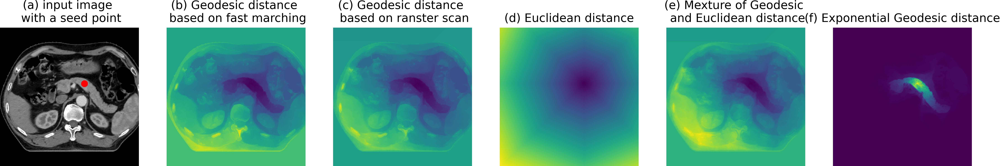

## MIDeepSeg: Minimally Interactive Segmentation of Unseen Objects from Medical Images Using Deep Learning [[MedIA](https://www.sciencedirect.com/science/article/pii/S1361841521001481) or [Arxiv](https://arxiv.org/pdf/2104.12166.pdf)] and [[Demo]](https://www.youtube.com/watch?v=eq-tqlJnckE)
This repository proivdes a 2D medical image interactive segmentation method for segmentation and annotation.


* This project was originally developed for our previous work [MIDeepSeg](https://arxiv.org/pdf/2104.12166.pdf), if you find it's useful for your research, please consider to cite the followings:

		@article{luo2021mideepseg,
                  title={MIDeepSeg: Minimally interactive segmentation of unseen objects from medical images using deep learning},
                  author={Luo, Xiangde and Wang, Guotai and Song, Tao and Zhang, Jingyang and Aertsen, Michael and Deprest, Jan and Ourselin, Sebastien and Vercauteren, Tom and Zhang, Shaoting},
                  journal={Medical Image Analysis},
                  volume={72},
                  pages={102102},
                  year={2021},
                  publisher={Elsevier}}

A visualization comparison of different distance transform methods, following [GeodisTK](https://github.com/taigw/GeodisTK).
## Requirements
Before you can use this package for image segmentation. You should:
* PyTorch version >=1.0.1
* Some common python packages such as Numpy, Pandas, SimpleITK,OpenCV, pyqt5, scipy......
* Install the [GeodisTK][geos_dis_link] for geodesic distance transformation.
* Install the [SimpleCRF][simplecrf_link] for interactive refinement.
## How to use
1, compile the requirement library:

```bash
pip install -r requirements.txt
```
2. launch the GUI
```bash
cd mideepseg
python main.py
``` 
3. load an image for segmentation. Once the image is loaded,  Firstly, give some edge points by left mouse to get an initial interactions, click the Segmentation button to obtain an initial segmentation. Then, press left mouse button to give clicks in under-segmented regions, and press right mouse button to give clicks  in over-segmented region. Then click the Refinement button, and the segmentation will be updated according to the interactions.

4. Note that, the pretrained model is only trained with placenta MR-T2 data. 

## Acknowledgment and Statement
* We thank the authors of [Deep_Extreme_Cut][dextr_link], [DeepIGeoS][deepigeos_link] and [BIFSeg][bifseg_link] for their elegant and efficient code base !

[geos_dis_link]: https://github.com/taigw/GeodisTK
[simplecrf_link]: https://github.com/HiLab-git/SimpleCRF
[dextr_link]: https://openaccess.thecvf.com/content_cvpr_2018/papers/Maninis_Deep_Extreme_Cut_CVPR_2018_paper.pdf
[deepigeos_link]: https://ieeexplore.ieee.org/document/8370732
[bifseg_link]: https://ieeexplore.ieee.org/stamp/stamp.jsp?arnumber=8270673
* This project was designed for academic research, not for clinical or commercial use, as it's a protected patent.  If you want to use it for commercial, please contact [Prof. Guotai Wang](https://scholar.google.com/citations?user=Z2sFN4EAAAAJ&hl=en).
